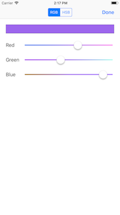

# Nativescript-ColorApplication

This application is designed using Nativescript with the VueJs. The application has two parts, the first is a random color generator, and the second is a drawing pad.

## Usage

The first part of the application helps to demonstrate to a user how the Red Green and Blue values affect HTML colors. 
This is done using a random generation process. 
The user is provided with a text box where they can type any text, and a button. When the button is pressed the application generates three random numbers between 0-255, one for each Red, Green and Blue. 
These numbers are displayed below the button as well as the resulting HTML hex code for the numbers. But for the user the real effect is that the text in the text box changes colors.

The second part of the application allows the user to draw on a blank canvas, the user starts out with a black marker on the drawing pad, however below the drawing area is a button to Show Color Picker. 
When this is clicked the user is provided a color selection screen with options to select using RGB (Red, Green, Blue)or HSB (Hue, Saturation, Brightness) color models. 
The user can used what they learned in the first part of the application or play with different combinations to find a color they would like to use in their drawing. 
Once a color is selected and the user pressed done the selected color text at the bottom of the page will change to the HTML HEX code for the selected color and when the user draws in the drawing area it will be with their new color. 
This part also allows the user to save their drawing or clear it from the screen, using the trash icon to clean and the save system icon to save the drawing.

### Screenshots


#### Part 1


#### Part 2





## Testing Instructions

Testing the application can be done in two ways. 
The first method is to use an iOS simulator. 
Then using the NSColorApp2.app file in the bin directory drag it onto the iOS simulator and it will install the application which can be tested there.

The second method is to put the application onto a device. This is difficult because of Apple's security features.
To do that you will need familiarity with creating a signing certificate and a provisioning profile for your device, set these up in Xcode.
Then you can download this project, change the nativescript id in the package.json file to the value of your provisioning profile, and use the following commands:

```bash
# Install dependencies
npm install

# Build, watch for changes and run the application
tns run ios --bundle
```

## Design

This application was made using the [nativescript-vue/vue-cli-template#next](https://github.com/nativescript-vue/vue-cli-template/tree/next).

I used Nativescript and Vue because I am familiar with javascript and vue development already and I found that it had a good and active community.
Nativescript is a javascript package that allows you to write javascript that outputs Nativescript XML and is then compiled to run on a mobile device. 
This allows it to be cross platform and work for either IOS or Android.

This made the development of this application only really a matter of creating the 2 .vue files for the two different parts of the application. These can be found in the apps/components folder.

When working with .vue files Nativescript-vue works in the same way as web development there is a template section which uses Nativescript XML to define the view of the applcation.
Then there is a script section which defines the Vue component code. Last is any css styles which should be applied to template elements. 


- RandomColorPicker.vue - This is the first component that starts the application. This is a fairly simple component providing the user with a text input, a button and a set of labels to display data. The functions in this file respond to the button press by generating random numbers to create a color. The only other piece of this file is the link in the navigation to the DrawingPad

- DrawingScreen.vue - The drawing screen component draws on all three external libraries defined below to render a drawing area and create a color picker as well as the native social functions on a phone. This component mostly acts a communication between these external libraries by calling the APIs. Putting these together allows the user to have a fully functioning drawing area which can use multiple colors and send the image using the email, messaging or other social functions of the phone.

## External Libraries

For this application I have used three external Nativescript libraries.

- [nativescript-color-picker](https://github.com/bradmartin/nativescript-color-picker): This is a complete color picker written for Nativescript applications, which I use on my drawing page.

- [nativescript-drawingpad](https://github.com/bradmartin/nativescript-drawingpad): This package provides an area which can be drawn in and the image saved out of, which I use to do such, passing in the color to draw with.

- [nativescript-social-share](https://github.com/tjvantoll/nativescript-social-share): This package provides the integration to open the native sharing toolbar which allows the user to send the image in an email or text message.